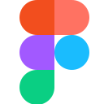
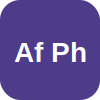
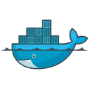
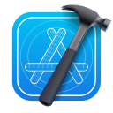

  

&nbsp;

&nbsp;

&nbsp;

&nbsp;

&nbsp;

&nbsp;

---

## 👋 About Me

<table>
<tr>
<td width="65%" valign="top">

**Full-Stack Developer & Founder** of [The Freelancer Marketing](https://the-freelancer-marketing.de) — turning static brand presences into living, interactive digital experiences since 2020.

I combine technical expertise with creative design thinking. My focus is on building modern web applications that don't just look great, but are performant, scalable, and maintainable. From landing pages to complex SaaS platforms — I deliver end-to-end solutions using **Next.js, React, TypeScript, Python, Flutter, Supabase** and **FastAPI**.

Beyond development, I build AI-powered tools. **Taskilo KI** is my multi-agent system with 19 specialized AI agents for business & finance — helping companies optimize taxes, manage risk, and plan strategically.

🇩🇪 🇨🇾 Based in **Germany & Cyprus** · 📧 [a.staudinger32@icloud.com](mailto:a.staudinger32@icloud.com)

</td>
<td width="35%" valign="top" align="center">

 

🔭 &nbsp; Currently building **[Taskilo Platform](https://taskilo.de)**

🤖 &nbsp; Running **[Taskilo KI](https://ki.taskilo.de)** in production

🎨 &nbsp; Designing in **Figma** daily

💬 &nbsp; Ask me about **Next.js, FastAPI, Flutter**

 

**`5+ years`** · **`50+ projects`** · **`100% passion`**

</td>
</tr>
</table>

---

## 🚀 Live Projects in Production

<table>
<tr>
<td width="33%" valign="top" align="center">

<a href="https://the-freelancer-marketing.de">
<picture>
  <source media="(prefers-color-scheme: dark)" srcset="./assets/Original%20Logo.svg">
  
</picture>
</a>

**[The Freelancer Marketing](https://the-freelancer-marketing.de)**

Digital agency — full-stack web apps, mobile apps & AI tools. 5+ years, 50+ projects delivered.

</td>
<td width="33%" valign="top" align="center">

<a href="https://taskilo.de">
<picture>
  <source media="(prefers-color-scheme: dark)" srcset="./assets/taskilo-logo-white.png">
  
</picture>
</a>

**[Taskilo Platform](https://taskilo.de)**

Enterprise SaaS — invoicing, projects, marketplace & CRM. Built with Next.js 15, FastAPI & Flutter.

</td>
<td width="33%" valign="top" align="center">

<a href="https://ki.taskilo.de">
<picture>
  <source media="(prefers-color-scheme: dark)" srcset="./assets/taskilo-logo-white.png">
  
</picture>
</a>

**[Taskilo KI](https://ki.taskilo.de)**

19 specialized AI agents for business & finance — tax optimization, risk management, strategic planning.

</td>
</tr>
</table>

---

## 🌐 Open-Source Projects I've Contributed To

<table>
<tr>
<td align="center" width="130"><a href="https://github.com/grommet/grommet"><b>Grommet</b></a></td>
<td align="center" width="130"><a href="https://github.com/storybookjs/storybook"><b>Storybook</b></a></td>
<td align="center" width="130"><a href="https://github.com/strapi/strapi"><b>Strapi</b></a></td>
<td align="center" width="130"><a href="https://github.com/nicokant/cyprusjs"><b>CyprusJS</b></a></td>
<td align="center" width="130"><a href="https://github.com/semantic-release/semantic-release"><b>Semantic-Release</b></a></td>
<td align="center" width="130"><a href="https://github.com/commitizen/cz-cli"><b>Commitizen</b></a></td>
</tr>
<tr>
<td align="center"></td>
<td align="center"></td>
<td align="center"></td>
<td align="center"></td>
<td align="center"></td>
<td align="center"></td>
</tr>
</table>

---

## 🛠️ Tech Stack & Proficiency

*Technology I love and use daily.*

<table>
<thead>
<tr>
<th align="center" width="60">Icon</th>
<th align="left" width="220">Name</th>
<th align="left" width="180">Category</th>
<th align="left" width="300">Skill</th>
</tr>
</thead>
<tbody>
<tr>
<td align="center"></td>
<td><a href="https://www.apple.com/macbook-pro/"><b>Apple Macbook Pro</b></a></td>
<td>Hardware</td>
<td></td>
</tr>
<tr>
<td align="center"></td>
<td><a href="https://www.apple.com/macos/"><b>Apple Mac OSX</b></a></td>
<td>Operating System</td>
<td></td>
</tr>
<tr>
<td align="center"></td>
<td><a href="https://www.microsoft.com/windows"><b>Microsoft Windows</b></a></td>
<td>Operating System</td>
<td></td>
</tr>
<tr>
<td align="center"></td>
<td><a href="https://www.linux.org/"><b>Linux</b></a></td>
<td>Operating System</td>
<td></td>
</tr>
<tr>
<td align="center"></td>
<td><a href="https://www.gnu.org/software/bash/"><b>Bash</b></a></td>
<td>Shell / Scripting</td>
<td></td>
</tr>
<tr>
<td align="center"></td>
<td><a href="https://code.visualstudio.com/"><b>Visual Studio Code</b></a></td>
<td>Code Editor</td>
<td></td>
</tr>
<tr>
<td align="center"></td>
<td><a href="https://github.com/features/copilot"><b>GitHub Copilot</b></a></td>
<td>AI Coding Tool</td>
<td></td>
</tr>
<tr>
<td align="center"></td>
<td><a href="https://github.com/features/actions"><b>GitHub Actions</b></a></td>
<td>DevOps / CI/CD</td>
<td></td>
</tr>
<tr>
<td align="center"></td>
<td><a href="https://www.figma.com/"><b>Figma</b></a></td>
<td>Web Design</td>
<td></td>
</tr>
<tr>
<td align="center"></td>
<td><a href="https://www.sketch.com/"><b>Sketch</b></a></td>
<td>Web Design</td>
<td></td>
</tr>
<tr>
<td align="center"></td>
<td><a href="https://affinity.serif.com/photo/"><b>Affinity Photo</b></a></td>
<td>Photo Editing</td>
<td></td>
</tr>
<tr>
<td align="center"></td>
<td><a href="https://affinity.serif.com/designer/"><b>Affinity Designer</b></a></td>
<td>Vector Graphics</td>
<td></td>
</tr>
<tr>
<td align="center"></td>
<td><a href="https://www.adobe.com/photoshop"><b>Photoshop</b></a></td>
<td>Photo Editing</td>
<td></td>
</tr>
<tr>
<td align="center"></td>
<td><a href="https://www.adobe.com/illustrator"><b>Illustrator</b></a></td>
<td>Vector Graphics</td>
<td></td>
</tr>
<tr>
<td align="center"></td>
<td><a href="https://www.apple.com/final-cut-pro/"><b>Final Cut Pro</b></a></td>
<td>Video Editing</td>
<td></td>
</tr>
<tr>
<td align="center"></td>
<td><a href="https://w3.org/html/"><b>HTML5</b></a></td>
<td>Markup Language</td>
<td></td>
</tr>
<tr>
<td align="center"></td>
<td><a href="https://w3.org/css/"><b>CSS3</b></a></td>
<td>Styling Language</td>
<td></td>
</tr>
<tr>
<td align="center"></td>
<td><a href="https://developer.mozilla.org/en-US/docs/Web/JavaScript"><b>JavaScript</b></a></td>
<td>Language</td>
<td></td>
</tr>
<tr>
<td align="center"></td>
<td><a href="https://www.typescriptlang.org/"><b>TypeScript</b></a></td>
<td>Language</td>
<td></td>
</tr>
<tr>
<td align="center"></td>
<td><a href="https://www.python.org/"><b>Python</b></a></td>
<td>Language</td>
<td></td>
</tr>
<tr>
<td align="center"></td>
<td><a href="https://nodejs.org/"><b>Node.js</b></a></td>
<td>Runtime</td>
<td></td>
</tr>
<tr>
<td align="center"></td>
<td><a href="https://fastapi.tiangolo.com/"><b>FastAPI</b></a></td>
<td>Backend Framework</td>
<td></td>
</tr>
<tr>
<td align="center"></td>
<td><a href="https://react.dev/"><b>React</b></a></td>
<td>JavaScript Library</td>
<td></td>
</tr>
<tr>
<td align="center"></td>
<td><a href="https://nextjs.org/"><b>Next.js</b></a></td>
<td>Full-Stack Framework</td>
<td></td>
</tr>
<tr>
<td align="center"></td>
<td><a href="https://flutter.dev/"><b>Flutter</b></a></td>
<td>Mobile / Cross-Platform</td>
<td></td>
</tr>
<tr>
<td align="center"></td>
<td><a href="https://storybook.js.org/"><b>Storybook</b></a></td>
<td>UI Documentation</td>
<td></td>
</tr>
<tr>
<td align="center"></td>
<td><a href="https://tailwindcss.com/"><b>Tailwind CSS</b></a></td>
<td>CSS Framework</td>
<td></td>
</tr>
<tr>
<td align="center"></td>
<td><a href="https://supabase.com/"><b>Supabase</b></a></td>
<td>Backend / Database</td>
<td></td>
</tr>
<tr>
<td align="center"></td>
<td><a href="https://www.postgresql.org/"><b>PostgreSQL</b></a></td>
<td>Database</td>
<td></td>
</tr>
<tr>
<td align="center"></td>
<td><a href="https://www.mongodb.com/"><b>MongoDB</b></a></td>
<td>Database</td>
<td></td>
</tr>
<tr>
<td align="center"></td>
<td><a href="https://www.docker.com/"><b>Docker</b></a></td>
<td>Containerization</td>
<td></td>
</tr>
<tr>
<td align="center"></td>
<td><a href="https://aws.amazon.com/"><b>Amazon AWS</b></a></td>
<td>Cloud Infrastructure</td>
<td></td>
</tr>
<tr>
<td align="center"></td>
<td><a href="https://git-scm.com/"><b>Git</b></a></td>
<td>Version Control</td>
<td></td>
</tr>
<tr>
<td align="center"></td>
<td><a href="https://bun.sh/"><b>Bun</b></a></td>
<td>Runtime / Package Manager</td>
<td></td>
</tr>
<tr>
<td align="center"></td>
<td><a href="https://www.npmjs.com/"><b>npm</b></a></td>
<td>Package Manager</td>
<td></td>
</tr>
<tr>
<td align="center"></td>
<td><a href="https://yarnpkg.com/"><b>Yarn</b></a></td>
<td>Package Manager</td>
<td></td>
</tr>
<tr>
<td align="center"></td>
<td><a href="https://github.com/nvm-sh/nvm"><b>NVM</b></a></td>
<td>Node Version Manager</td>
<td></td>
</tr>
<tr>
<td align="center"></td>
<td><a href="https://brew.sh/"><b>Homebrew</b></a></td>
<td>Package Manager</td>
<td></td>
</tr>
<tr>
<td align="center"></td>
<td><a href="https://developer.apple.com/xcode/"><b>Xcode</b></a></td>
<td>IDE / Dev Environment</td>
<td></td>
</tr>
<tr>
<td align="center"></td>
<td><a href="https://www.google.com/chrome/"><b>Chrome</b></a></td>
<td>Web Browser</td>
<td></td>
</tr>
<tr>
<td align="center"></td>
<td><a href="https://www.apple.com/safari/"><b>Safari</b></a></td>
<td>Web Browser</td>
<td></td>
</tr>
<tr>
<td align="center"></td>
<td><a href="https://vuejs.org/"><b>Vue.js</b></a></td>
<td>JavaScript Framework</td>
<td></td>
</tr>
<tr>
<td align="center"></td>
<td><a href="https://kubernetes.io/"><b>Kubernetes</b></a></td>
<td>Orchestration</td>
<td></td>
</tr>
<tr>
<td align="center"></td>
<td><a href="https://strapi.io/"><b>Strapi</b></a></td>
<td>Headless CMS</td>
<td></td>
</tr>
<tr>
<td align="center"></td>
<td><a href="https://wordpress.org/"><b>WordPress</b></a></td>
<td>CMS</td>
<td></td>
</tr>
<tr>
<td align="center"></td>
<td><a href="https://trello.com/"><b>Trello</b></a></td>
<td>Project Management</td>
<td></td>
</tr>
<tr>
<td align="center"></td>
<td><a href="https://zapier.com/"><b>Zapier</b></a></td>
<td>Automation</td>
<td></td>
</tr>
<tr>
<td align="center"></td>
<td><a href="https://daringfireball.net/projects/markdown/"><b>Markdown</b></a></td>
<td>Markup</td>
<td></td>
</tr>
</tbody>
</table>

---

## 📊 GitHub Activity

&nbsp;&nbsp;

  

  

---

**🤝 Let's build something great together!**

&nbsp;

&nbsp;

&nbsp;

